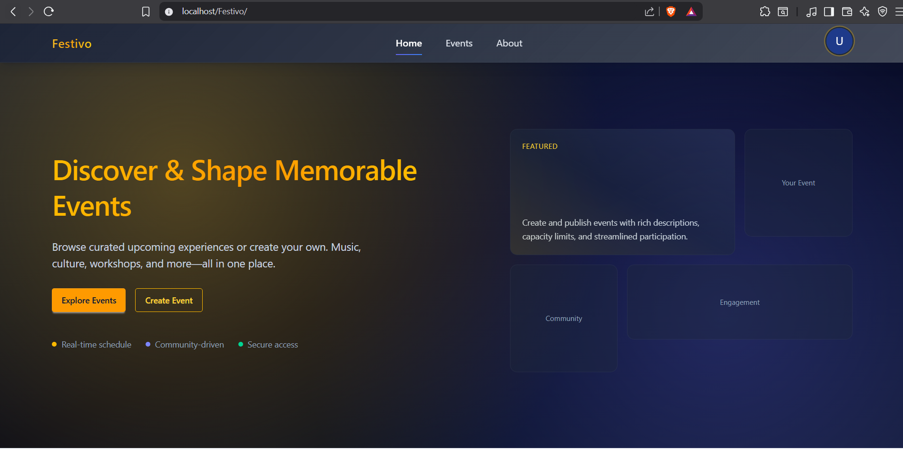

# Festivo

Lightweight PHP + MySQL event management app designed to run on XAMPP. Create events, manage your own, and let users participate.

## Screenshot


## Features
- Public pages: Home, Events list, Single event
- Auth: Register, Login, Logout (secure password hashing, Argon2id if available, fallback to bcrypt)
- Dashboard: Overview (live stats), Create Event, My Events (table with View/Edit/Delete), Participated Events, Participants list for each event
- Participation: Users can join events; organizers cannot join their own events
- Schema-flexible: Detects common column variations (creator field, status/capacity, user fields) to reduce schema mismatch issues

## Requirements
- XAMPP on Windows (Apache + MySQL + PHP)
- PHP 7.4+ (PHP 8.x recommended)
  - Argon2id hashing used if available in your PHP build; otherwise bcrypt is used automatically
- MySQL/MariaDB

## Quick Start (XAMPP)
1. Place the project under XAMPP htdocs
   - Folder: `D:\xampp\htdocs\Festivo`
2. Start Apache and MySQL in the XAMPP Control Panel
3. Create the database
   - Open http://localhost/phpmyadmin
   - Create a database named `festivo` (utf8mb4)
   - Option A: Import the full schema from `schema.md` (copy SQL into phpMyAdmin SQL tab)
   - Option B: Start simple with just the 3 tables below (sample DDL):
     - users (with at least id/email/password columns)
     - events (with at least event_id/title/start_time/end_time/category/location and a creator column like user_id)
     - event_participants (event_id, user_id with UNIQUE(event_id,user_id))
4. Configure DB connection
   - File: `dbConnect.php`
   - Defaults assume XAMPP: user=root, no password, database=festivo
   - Adjust if your MySQL credentials differ
5. Visit the app
   - http://localhost/Festivo/
   - Register a user, then create and manage events from Dashboard

## Folder Structure (key files)
- `index.php` – Homepage with upcoming events
- `events.php` – All upcoming/published events
- `event.php` – Single event page with participate action
- `login.php`, `register.php`, `logout.php` – Auth
- `dashboard.php` – Overview (stats + recent items)
- `dashboard_create.php` – Create event (redirects to My Events on success)
- `dashboard_my_events.php` – Your events table with View/Edit/Delete/Participants
- `dashboard_edit_event.php`, `dashboard_delete_event.php` – Edit and Delete routes
- `dashboard_event_participants.php` – Participants list for your event
- `navbar.php`, `footer.php` – Layout partials
- `dbConnect.php` – MySQL connection (edit credentials here)
- `schema.md` – Full SQL schema and notes

## Base URL
The app uses a base URL in several pages:
- `http://localhost/Festivo/`
If you deploy to a different folder or host, update `$baseUrl` near the top of these files:
- `navbar.php`, `index.php`, `events.php`, `event.php`, `login.php`, `register.php`, `dashboard*.php`

## Configuration Notes
- PHP extensions: ensure `mysqli` is enabled (it is on XAMPP by default)
- Timezone: set `date.timezone` in `php.ini` to match your locale for consistent times
- MySQL credentials: default XAMPP uses `root` with no password; change `dbConnect.php` if you set one

## Database Schema
See `schema.md` for a complete, production-friendly schema (users, events, event_participants) with indexes and notes.

The app is tolerant to schema variations:
- Events creator column can be `created_by`, `organizer_id`, or `user_id`
- Optional columns auto-detected: `status`, `capacity`
- Users table fields auto-detected where possible: id, email, display/name, avatar

Minimum columns recommended:
- users: `user_id` (PK, AUTO_INCREMENT), `email` (UNIQUE), `password` or `password_hash`, optional `display_name`
- events: `event_id` (PK), `user_id` (creator), `title`, `category`, `location`, `start_time`, `end_time`, optional `capacity`, `status`
- event_participants: `id` (PK), `event_id`, `user_id`, `UNIQUE(event_id, user_id)`

### Optional: Minimal Seed SQL
You can paste this in phpMyAdmin if you want a quick start (adjust as needed):

```sql
CREATE DATABASE IF NOT EXISTS festivo CHARACTER SET utf8mb4 COLLATE utf8mb4_unicode_ci;
USE festivo;

CREATE TABLE IF NOT EXISTS users (
  user_id INT UNSIGNED AUTO_INCREMENT PRIMARY KEY,
  email VARCHAR(150) NOT NULL UNIQUE,
  password VARCHAR(255) NOT NULL,
  display_name VARCHAR(100) NULL
) ENGINE=InnoDB;

CREATE TABLE IF NOT EXISTS events (
  event_id INT UNSIGNED AUTO_INCREMENT PRIMARY KEY,
  user_id INT UNSIGNED NOT NULL,
  title VARCHAR(150) NOT NULL,
  category VARCHAR(50) NOT NULL DEFAULT 'other',
  location VARCHAR(200) NULL,
  start_time DATETIME NOT NULL,
  end_time DATETIME NOT NULL,
  capacity INT UNSIGNED NULL,
  status VARCHAR(20) NOT NULL DEFAULT 'published',
  INDEX (user_id)
) ENGINE=InnoDB;

CREATE TABLE IF NOT EXISTS event_participants (
  id INT UNSIGNED AUTO_INCREMENT PRIMARY KEY,
  event_id INT UNSIGNED NOT NULL,
  user_id INT UNSIGNED NOT NULL,
  UNIQUE KEY uq_event_user (event_id, user_id)
) ENGINE=InnoDB;
```

## Routes & Pages
Public
- `/` → `index.php` (Homepage + upcoming events)
- `/events.php` → All published upcoming events (list)
- `/event.php?id=...` → Single event page

Auth
- `/register.php`, `/login.php`, `/logout.php`

Dashboard
- `/dashboard.php` → Overview (live counts and recent lists)
- `/dashboard_create.php` → Create event (redirects to My Events on success)
- `/dashboard_my_events.php` → Table of your events with View/Edit/Delete/Participants
- `/dashboard_edit_event.php?id=...` → Edit your event
- `/dashboard_delete_event.php` (POST) → Delete your event
- `/dashboard_event_participants.php?event_id=...` → Participants for your event

## Behavior Notes
- Password hashing: Argon2id (if supported by PHP build), else bcrypt
- Sessions are guarded to avoid duplicate `session_start()` warnings
- No CSRF tokens (per project choice); ownership checks enforced on edit/delete/participants
- PRG (Post/Redirect/Get) used for actions like participate and create/update to avoid resubmits
- Organizers cannot participate in their own events

## Known Limitations
- No CSRF tokens (by design choice); add if you need stronger protection for form actions
- Not optimized for large datasets; consider pagination for events/participants
- No email sending or password reset flow yet

## Troubleshooting
- "Database connection failed": ensure MySQL is running and credentials in `dbConnect.php` are correct
- Unknown column errors in auth or events:
  - The app tries to auto-detect columns, but if your schema differs a lot, align with `schema.md` or adjust code mappings
- Times look off:
  - Ensure your PHP timezone (php.ini) and MySQL timezone match your expectations. The app normalizes HTML `datetime-local` to MySQL DATETIME.
- Argon2 not available on Windows:
  - XAMPP PHP builds may not include Argon2; the app automatically falls back to bcrypt

## Development Tips
- Tailwind/DaisyUI are loaded via CDN in templates; no build step required
- Keep `schema.md` as the source of truth for DB design; update indexes if event volume grows
- If you move the app path, update `$baseUrl` occurrences

## License
This project is for educational purposes. Adapt as needed for your deployment.
